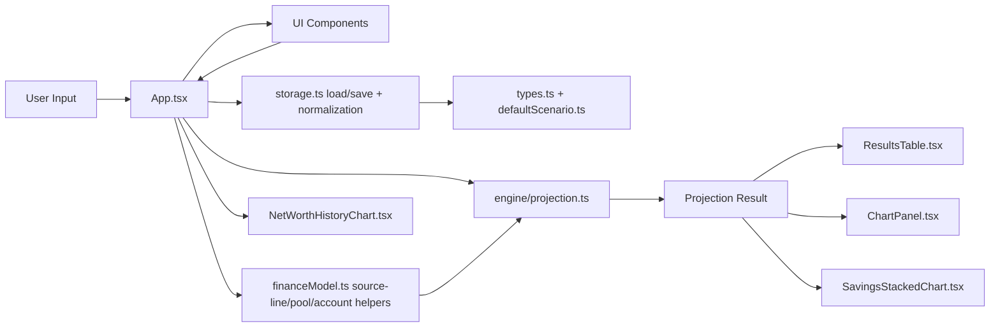

# Code Map

## Project Tree (Core Files)
```text
Finance Planner/
  AGENTS.md
  CODEMAP.md
  README.md
  todo.txt
  todoexpenses.txt
  docs/
    ARCHITECTURE.md
    CALC_ENGINE.md
    DOMAIN_MODEL.md
    FEATURE_MAP.md
    INDEX.md
    STATE_PERSISTENCE.md
    TEST_MAP.md
  src/
    components/
      BufferedNumberInput.tsx
      CareerPlanEditor.tsx
      CashflowItemEditor.tsx
      ChartPanel.tsx
      ExpensesPlanner.tsx
      LifeEventEditor.tsx
      NetWorthHistoryChart.tsx
      ResultsTable.tsx
      SavingsStackedChart.tsx
      YearMonthInput.tsx
    data/
      historicalReturns.ts
    engine/
      projection.ts
      projection.test.ts
    importers/
      bankImport.ts
      bankImport.test.ts
      expenseImport.ts
    utils/
      ageDate.ts
    App.tsx
    App.test.tsx
    defaultScenario.ts
    financeModel.ts
    main.tsx
    storage.ts
    styles.css
    types.ts
```

## Architecture Flow (Block Diagram)


## Component Roles
- `src/App.tsx`: Composition root, tab routing, state updates, source-line editing.
- `src/storage.ts`: Persistence and migration normalizers.
- `src/financeModel.ts`: Pool/account/source-line conversions and compatibility helpers.
- `src/engine/projection.ts`: Deterministic projection simulation (careers, retirement, purchases, loans).
- `src/components/CareerPlanEditor.tsx`: Career timeline and per-account contribution/withdrawal editing.
- `src/components/ExpensesPlanner.tsx`: Expense planning/tracking workspace and import audit UI.
- `src/components/ResultsTable.tsx`: Dynamic account-based yearly output table.
- `src/components/SavingsStackedChart.tsx`: Pool-based stacked chart filtering/aggregation.
- `src/components/NetWorthHistoryChart.tsx`: Historical net worth chart.
- `src/importers/bankImport.ts`: Bank statement import parsing for net worth updates.
- `src/importers/expenseImport.ts`: Expense import parsing for expense entries.

## Fast Path
- Projection logic: `src/engine/projection.ts`
- Scenario model/schema: `src/types.ts`, `src/defaultScenario.ts`, `src/storage.ts`
- Pool/account behavior: `src/financeModel.ts`, `src/App.tsx`
- Purchases/loans UI behavior: `src/App.tsx`
- Expenses behavior: `src/components/ExpensesPlanner.tsx`, `src/importers/expenseImport.ts`
