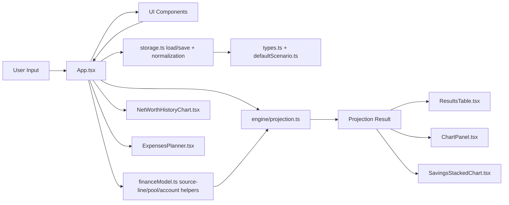

# Code Map

## Project Tree (Core Files)
```text
Finance Planner/
  AGENTS.md
  CODEMAP.md
  gitchanges.md
  testplanfix.md
  README.md
  todo.txt
  docs/
    ARCHITECTURE.md
    CALC_ENGINE.md
    DOMAIN_MODEL.md
    FEATURE_MAP.md
    INDEX.md
    STATE_PERSISTENCE.md
    TEST_MAP.md
    LegacyRemoval.md
    ManualContributionLeakPlan.md
  src/
    components/
      BufferedNumberInput.tsx
      CareerPlanEditor.tsx
      CashflowItemEditor.tsx
      ChartPanel.tsx
      ColorPickerField.tsx
      ExpensesPlanner.tsx
      LifeEventEditor.tsx
      NetWorthHistoryChart.tsx
      ResultsTable.tsx
      SavingsStackedChart.tsx
      YearMonthInput.tsx
      flagCalloutLayout.ts
    data/
      historicalReturns.ts
    engine/
      projection.ts
      projection.test.ts
    importers/
      bankImport.ts
      bankImport.test.ts
      expenseImport.ts
    utils/
      ageDate.ts
      colorPalette.ts
    App.tsx
    App.test.tsx
    defaultScenario.ts
    financeModel.ts
    main.tsx
    storage.ts
    styles.css
    types.ts
```

## Architecture Flow (Block Diagram)

```mermaid
flowchart LR
  U[User Input] --> A[App.tsx]
  A --> C[UI Components]
  C --> A
  A --> S[storage.ts load/save + normalization]
  S --> T[types.ts + defaultScenario.ts]
  A --> F[financeModel.ts source-line/pool/account helpers]
  A --> E[engine/projection.ts]
  F --> E
  E --> O[Projection Result]
  O --> RT[ResultsTable.tsx]
  O --> CP[ChartPanel.tsx]
  O --> SS[SavingsStackedChart.tsx]
  A --> NW[NetWorthHistoryChart.tsx]
  A --> EP[ExpensesPlanner.tsx]
```

## Component Roles
- `src/App.tsx`: Composition root, tab routing, state updates, purchase sorting, category management, credit card editing.
- `src/storage.ts`: Persistence and normalization including credit card, purchase category, and paycheckInfo mode fields.
- `src/financeModel.ts`: Small helpers (~35 lines, `normalizePurchaseFundingSource` + `getDefaultBankAccountIdForPool`).
- `src/engine/projection.ts`: Deterministic projection simulation (careers, retirement, purchases, loans, credit cards). Monthly loop processes credit card payments, long-term purchases, and sourceLine contributions.
- `src/components/CareerPlanEditor.tsx`: Career timeline, paycheck editing with retirement/HSA amount/percentage mode toggles, "Copy Pay from Previous" button.
- `src/components/ExpensesPlanner.tsx`: Expense planning/tracking workspace and import audit UI.
- `src/components/ChartPanel.tsx`: Portfolio value chart with credit card debt line overlay.
- `src/components/ResultsTable.tsx`: Dynamic account-based yearly output table.
- `src/components/SavingsStackedChart.tsx`: Pool-based stacked chart filtering/aggregation.
- `src/components/NetWorthHistoryChart.tsx`: Historical net worth chart.
- `src/components/ColorPickerField.tsx`: Color picker for purchase/loan flags.
- `src/components/YearMonthInput.tsx`: Year-month input with up/down buttons.
- `src/components/flagCalloutLayout.ts`: Flag callout layout on charts.
- `src/importers/bankImport.ts`: Bank statement import parsing for net worth updates.
- `src/importers/expenseImport.ts`: Expense import parsing for expense entries.

## Fast Path
- Projection logic: `src/engine/projection.ts`
- Scenario model/schema: `src/types.ts`, `src/defaultScenario.ts`, `src/storage.ts`
- Paycheck/take-home math: `src/engine/projection.ts` (lines ~617-650)
- Retirement/HSA match deposit math: `src/engine/projection.ts` (lines ~659-675)
- Credit card processing: `src/engine/projection.ts` (lines ~709-800)
- Income waterfall: `src/engine/projection.ts` (lines ~523-584)
- Depletion detection: `src/engine/projection.ts` (lines ~1644-1649)
- Purchases/loans UI: `src/App.tsx`
- Credit card UI (table + edit modal + schedule): `src/App.tsx` (creditCards sub-tab)
- Expenses: `src/components/ExpensesPlanner.tsx`, `src/importers/expenseImport.ts`
- Session changelog: `gitchanges.md`
- Test fix plan: `testplanfix.md`
